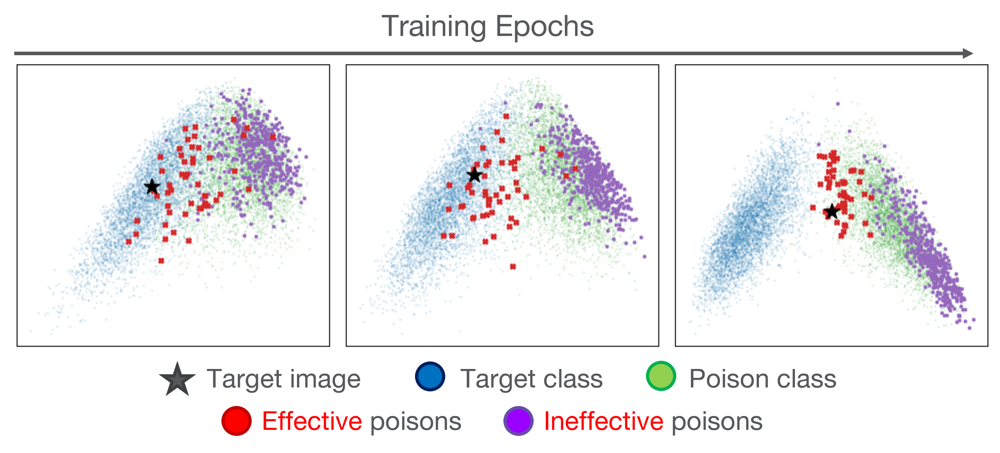

# Not All Poisons are Created Equal: Robust Training against Data Poisoning (ICML 2022)
[[Paper](https://proceedings.mlr.press/v162/yang22j/yang22j.pdf)]

## Overview
**EPIC (Effective Poison Identification)** is an efficient defense mechanism that significantly reduces the attack success rate of various data poisoning attacks by iteratively find and drop the isolated points in low-density gradient regions. 

* Not all poisons are created equal - only effective poisons are responsible for the success of an attack. They are closer to the target in the gradient space. 


* Effective poisons are isolated in the gradient space and thus can be found and dropped by EPIC iteratively during the training. 

## Updates
[Aug 6th, 2022] We released the code of EPIC.

[July 20th, 2022] We presented our paper at ICML 2022. 

## Install requirements
```
pip install -r requirements.txt
```
## Prepare the Data
Precomputed poisoned datasets that are publicly available can be downloaded with the links below.

* Gradient Matching ([official repo](https://github.com/JonasGeiping/poisoning-gradient-matching)): [eps=8](https://www.dropbox.com/sh/y8bwq0fqqkcz36d/AABCu5cMX0hzbnwnZkHau0gea/benchmark_v1_cml/bm_base_ResNet18?dl=0&subfolder_nav_tracking=1), eps=16

* Bullseye Polytope ([official repo](https://github.com/ucsb-seclab/BullseyePoison)): CIFAR-10 transfer, CIFAR-10 fine-tuning, [TinyImageNet from scratch](https://drive.google.com/drive/folders/1aKoz1sevqLLGheMHRF5SITczgTc43sjB)

* Feature Collision ([official repo](https://github.com/ashafahi/inceptionv3-transferLearn-poison)): CIFAR-10 transfer

* Sleeper Agent

## Usage
See `examples.sh` for example usages. 

## Acknowledgements
Some code in this repo comes from the following repositories:

* [Data-efficient Training of Machine Learning Models](https://github.com/baharanm/craig)

* [Just How Toxic is Data Poisoning? A Unified Benchmark for Backdoor and Data Poisoning Attacks](https://github.com/aks2203/poisoning-benchmark)

We thank these authors for making their code open-source. 

# Citation
Please cite our paper if you find the results or our code useful. :beers:
```
@inproceedings{yang2022not,
  title={Not All Poisons are Created Equal: Robust Training against Data Poisoning},
  author={Yang, Yu and Liu, Tian Yu and Mirzasoleiman, Baharan},
  booktitle={International Conference on Machine Learning},
  pages={25154--25165},
  year={2022},
  organization={PMLR}
}
```